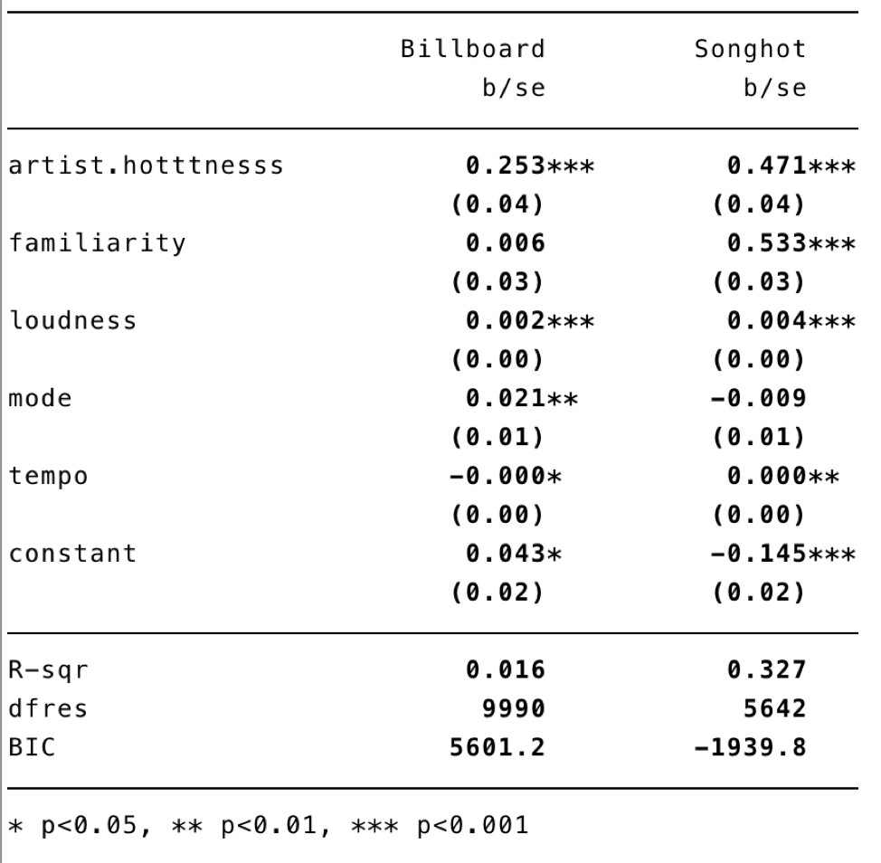
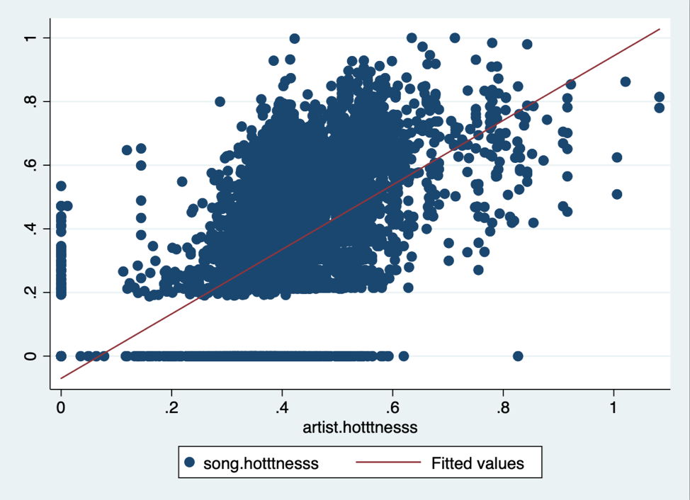
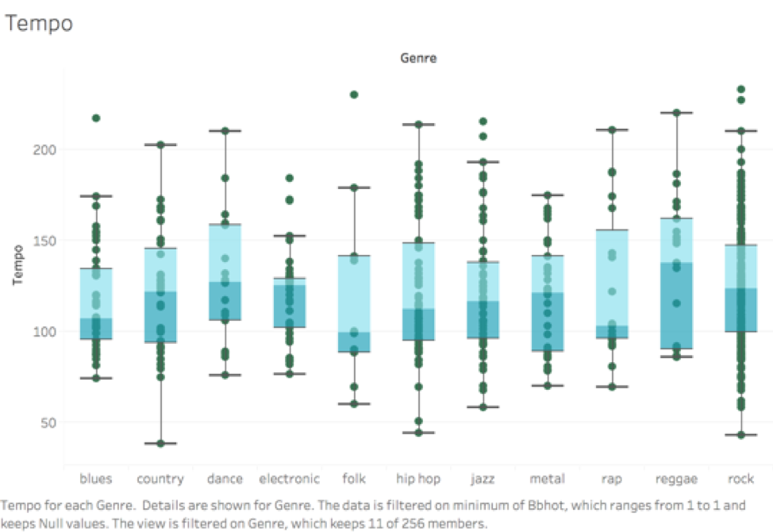
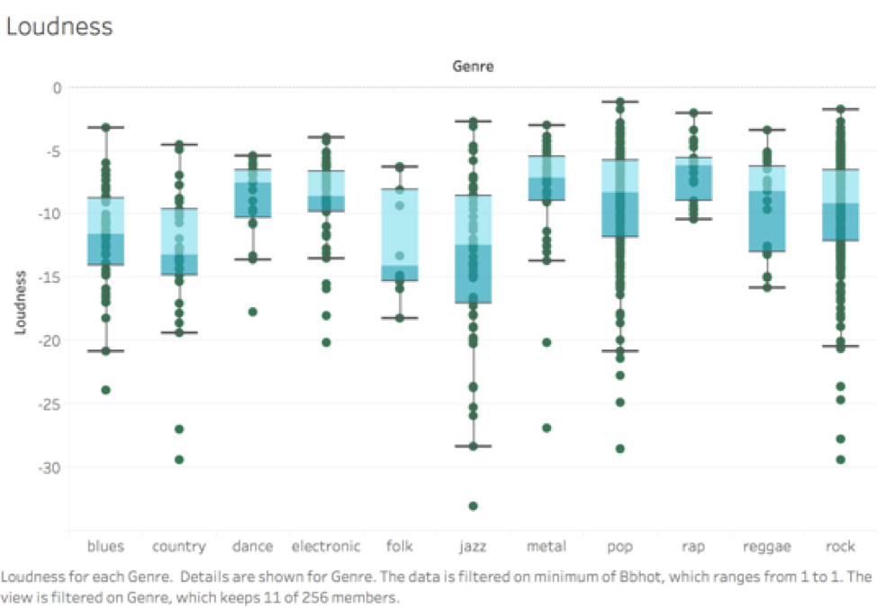
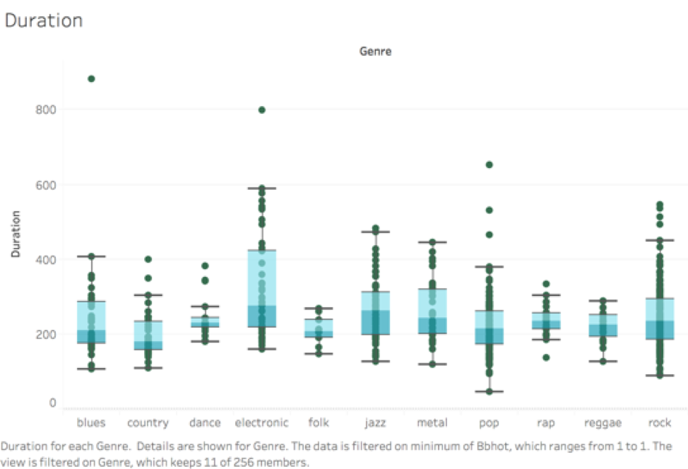
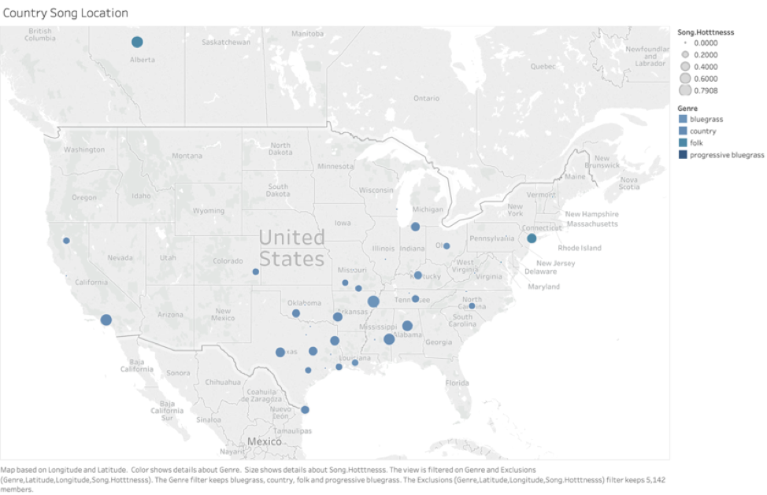
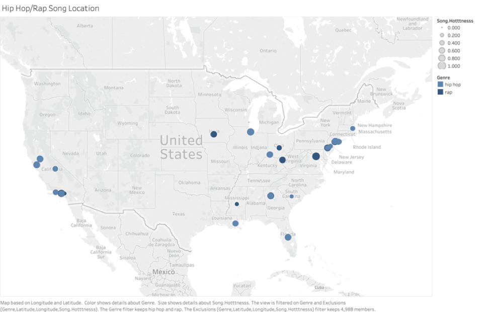

# songAnalysis

## About
This was a course project that was supposed to determine audio features that made certain songs popular. In 2018, the music industry reached a retail value of $19.6 billion in the United States alone. Each year billions of songs are released, but only 27 singles have ever reached diamond status (+10,000,000 units sold or equivalently streamed). What makes these songs rise above the rest? What key features can be analyzed and used to predict how popular a song may become?

## Data

Rather than analyzing raw audio files, a subset of the Million Songs Dataset which was parsed by the Echno Nest API to extract audio and descriptive features for each song. From this set of features we chose to focus our analysis around the following 10 key attributes: song hotness, artist hotness, duration, familiarity, key, loudness, tempo, time signature  and mode. The data set was compared a subset of Billboard Top 100 songs from 1958-2017 and used a boolean variable (bbhot) to indicate a songs presence in the Top 100 (1) or not (0). Data was analyzed across two popularity ratings: song hotness (as determined by echoNest based on plays and media coverage) and billboard presence.

## Results

Model 1: regress bbhot artisthotttnesss duration familiarity key loudness mode tempo time_signature, r
 
Model 2: regress songhotttness artisthotttnesss duration familiarity key loudness mode 
tempo time_signature, r

 
 
    
 

 
 
 
    
 

These regressions show that with both measures of popularity, artist hotness and loudness are statistically significant at any level. Additional factors like mode and familiarity were each significant in only one model.

The R² value in in Model 1 was extremely low which suggests that while statistically different from 0, the features above did not explain much of the variation found. In Model 2, the R² value was much higher suggesting that much more variation was explained through the model.

These are some of the results of looking at some of the song features across different genres:

  
   
  

## Conclusion 

While it is clear that there are song attribute trends that vary from genre to genre, when analyzing the results from our regressions, it is difficult if not impossible to predict popularity for songs based on their characteristics. We believe this is the case for a variety of reasons; including the facts that  we are not analyzing the lyrical content of songs, we are not considering the pop culture trends that are taking place at the time the song was released, and we are not analyzing the mood or emotions the song elicits. 
 
 
    
 

  
 
    
 

 
Most likely the combination of a song’s attributes, its lyrics, and its context that make a song popular. In other words, its human creativity and ingenuity are what make a song special. Our work demonstrates that art is truly special because it embodies the human condition...there is something special about humanity that differentiates us from machines and other conscious beings that enables us to create music. 
